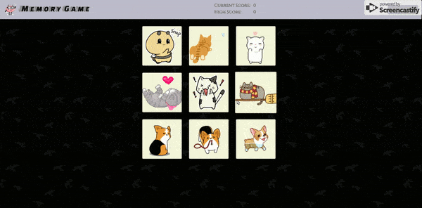

# Memory-Check
Your score increases with each character you click on, but be careful! If you've clicked on the character already, the game ends. Try to beat your high score!

[Memory Checker](https://robertshaw87.github.io/memory-check)

## Getting Started

Open up the [project link](https://robertshaw87.github.io/memory-check) and you should be able to see the webpage shown below:

Simply start clicking on the images to begin playing! You will be scored based on how many images you managed to click on before you click on one you've already chosen.

Try to select all 15 images without repeats and beat the game!

### Prerequisites

You need to have a modern browser able to handle html5, javascript, and css. 

### Installing

No installation needed! Just open the page in your preferred browser.

## Built With

* Html

* CSS

* [Javascript](https://www.javascript.com/) - The scripting language used

* [BootstrapCDN v4.1.0](https://getbootstrap.com/docs/4.1/getting-started/introduction/) - The web framework used

* [React](https://reactjs.org/) - Javascript library for creating user interfaces

## Authors

* **Robert Shaw** - *Initial work* - [robertshaw87](https://github.com/robertshaw87)